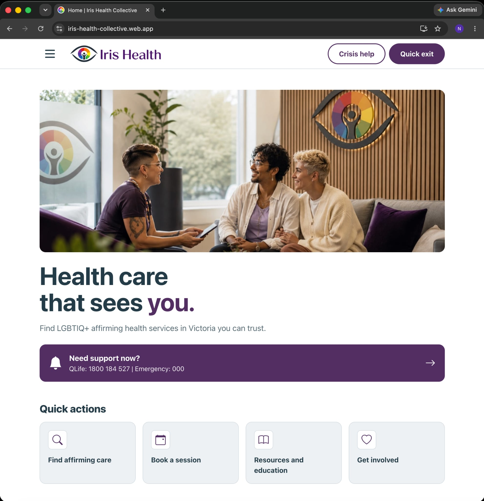
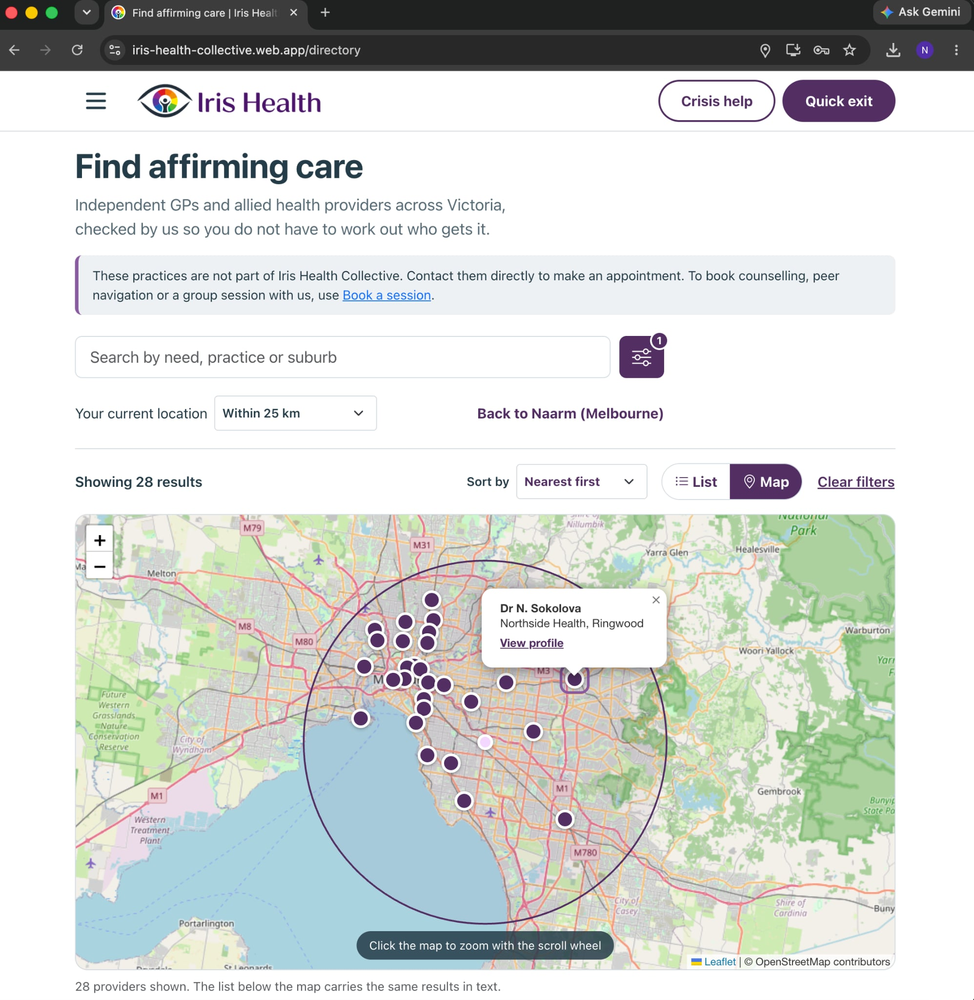
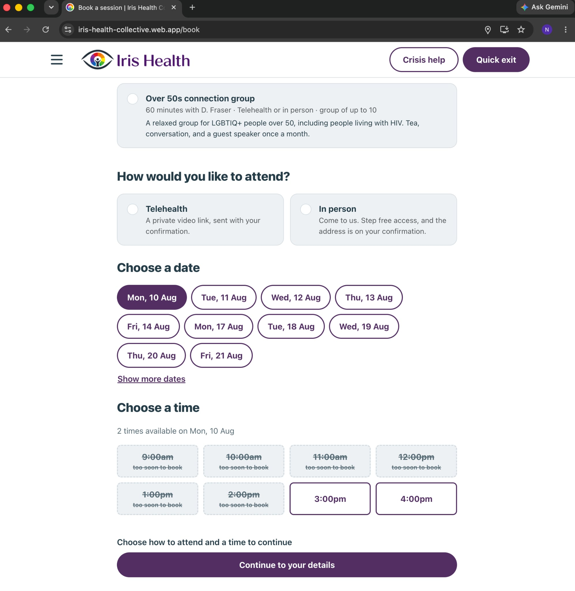
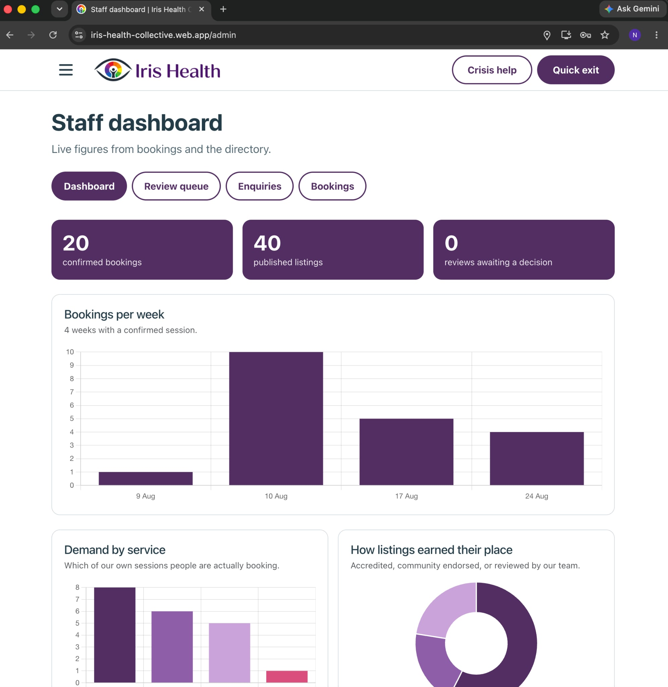
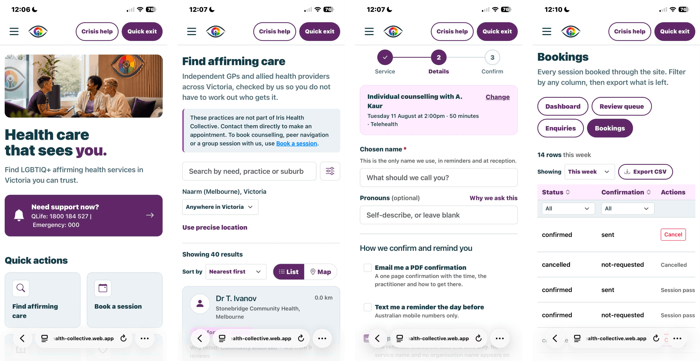
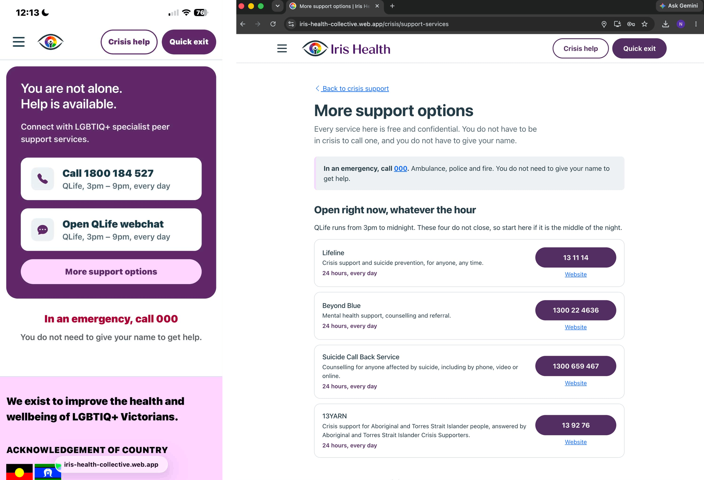
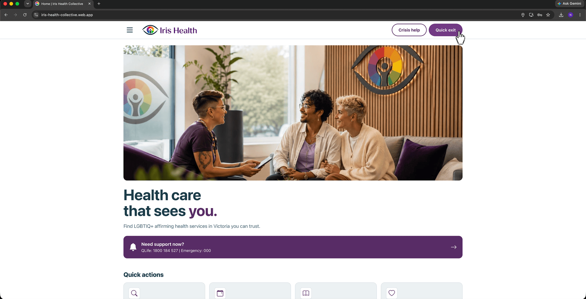

# Iris Health Collective

A web application for a fictional Melbourne LGBTIQ+ health charity, built for
Monash ITO5032 Assessment 3.

- **Live site:** https://iris-health-collective.web.app
- **Video demonstration:** https://youtu.be/QYyLoFDkg9I

The charity provides counselling, peer support and a vetted directory of
affirming GPs across Victoria. The site lets people search that directory, book
a session and read the guides without creating an account.

Three findings from the Assessment 1 research shape most of what follows:

- **Browsing leaves no trace.** The directory, resources and crisis contacts all
  work with no account and no session.
- **The exit is always there.** A Quick exit control sits in the header of every
  page and responds to the Esc key.
- **Nobody writes their own credentials.** Ratings and inclusion status are
  computed on the server from moderated reviews, and accreditations are recorded
  by the charity. A practice cannot award itself a badge.

## Screenshots

| Home | Find affirming care |
| --- | --- |
|  |  |

| Book a session | Staff dashboard |
| --- | --- |
|  |  |

The dashboard is only reachable with a staff role on the account. A member
signing in gets their own bookings, their profile and their privacy settings.
[Who can do what](#who-can-do-what) sets out the three levels in full.

The UI is optimised for mobile as well:



## Safety by design

Crisis help and Quick exit sit in the header of every page. A normal booking
site has neither, and between them they explain a lot of the layout decisions
elsewhere. On a phone there is not room for both of them and the full logo, so
the logo gives way to the Iris eye on its own. Brand recognition matters less
here than a way to reach someone and a way out.

The personas from Assessment 1 are the reason. They browse on borrowed or
shared phones, they are not always out to the people around them, and some of
them are looking for help at the worst moment of their week. None of that
leaves room to hunt through a menu. Both controls stay in the same place at
every width, so they can be found without being looked for.

### Crisis help in the header

Crisis help sits ahead of the navigation and ahead of the logo. Assessment 1 set
a target of reaching a real person within a minute of landing, and that ordering
is what meets it. The support services page behind the button lists what is open
right now, because QLife closes at 9pm and the page exists for the hours it
is shut.



### Quick exit

Quick exit replaces the current tab with a neutral site through a
history-replacing redirect, so the back button does not return here. It also
responds to the Esc key. Its placement and labelling follow published research
on exit buttons (Turk & Hutchings, 2023).



It cannot clear a full browser history or undo a saved password. The site says
so plainly, and the digital safety guide under Resources covers what it can and
cannot do.

## Who can do what

There are three levels of access: a visitor with no account, a signed in member,
and charity staff.

A role is a custom claim on the Firebase ID token, written only by the
`setUserRole` function. Staff carry `role: 'admin'`; a member is the absence of a
claim, so there is no value to misread and nothing in a document for its owner to
edit. `firestore.rules` reads the claim rather than any stored field, which is
why the boundary holds for someone who skips the app and calls the API directly.
The router guards are convenience on top of that, not the boundary itself.

| | Visitor | Member | Staff |
| --- | --- | --- | --- |
| Browse the directory, resources and crisis contacts | Yes | Yes | Yes |
| Book a session and get a PDF confirmation by email | Yes | Yes | Yes |
| Cancel a booking | Own, from the confirmation screen | Own, any time | Anyone's |
| Send any contact form | Yes | Yes | Yes |
| Read approved reviews | Yes | Yes | Yes |
| Leave a review | No | One per practice | **No** |
| Account area: profile, own bookings, data download, deletion | No | Yes | Yes |
| Staff dashboard: charts, queues, CSV export, role assignment | No | No | Yes |

### Visitors, with no account

Browsing leaves no trace, so the directory, the guides and the crisis pages need
no account and no session. Booking creates an anonymous session rather than an
account, and `claimBooking` moves that booking onto a real account later if the
person decides they want one. The confirmation screen can cancel the booking it
just made, so a visitor is not stuck with an appointment they cannot undo, but
there is no account area listing it afterwards. Contact forms take no auth at
all: someone reporting a practice that treated them badly should not have to
identify themselves to do it.

A visitor cannot leave a review. An anonymous session is free to throw away and
make again, and moderating that is a losing game, so reviews need an account
somebody had to create.

### Members

A member gets everything above plus their own account area: chosen name and
pronouns, their upcoming bookings with a cancel button, their reminder
preference, a CSV of their own data, and account deletion. They can read their
own review whatever its status, which nobody else outside staff can.

**One review per person per practice.** The review document is named after the
reviewer's uid, so a second attempt on the same practice is refused by
`submitReview` rather than quietly replacing the first. One disgruntled visit
cannot become ten ratings, and an approved review cannot be silently reverted to
pending by rewriting it.

A member cannot approve their own review, read anyone else's booking, enquiry or
pending review, edit a listing, award an accreditation badge, or change their own
role. The rules deny the last one field by field, so an update that touches
`role` fails even from the owner of the document.

### Staff

Staff get the dashboard at `/admin`, and it is the only place any of this
happens:

- **Approve or reject reviews** in the moderation queue. Nothing counts toward a
  practice's rating until a staff member decides on it.
- **See the data**: bookings per week, demand by service, and how each listing
  earned its place in the directory, all over live Firestore data.
- **Export CSV** from all three tables, respecting whatever filters and
  reporting period are on screen.
- **Track every enquiry** submitted through any form on the site, across all
  eight topics, in one queue.
- **Cancel any booking**, which is what happens when somebody rings up instead
  of doing it themselves, and **assign roles** by email address.

**Staff cannot leave reviews.** `submitReview` refuses an admin token and the
review form on a listing says so instead of rendering. Staff are the ones who
approve reviews, so a staff review would be approved by whoever wrote it, and
the ratings stay community driven. Nor is a rating something staff type in:
`firestore.rules` denies every client write to a review, whoever is asking, and
`onReviewWrite` is the only thing that writes `ratingAvg`, `ratingCount` and
`inclusionBasis`, recomputed from the approved reviews each time one changes.

## Stack

Vue 3 with the Composition API, Vite, Pinia, Vue Router, Bootstrap 5.
Firebase for Authentication, Firestore, Cloud Functions and Hosting.
Zod for validation, Leaflet for maps, Chart.js for the staff dashboard,
Resend for email, pdf-lib for the booking confirmation.

## Running it locally

You need Node 22.18 or later (24.12 and up also works), a Firebase project on the
Blaze plan, and the Firebase CLI (`npm install -g firebase-tools`). The functions
themselves deploy on the Node 22 runtime.

### 1. Install

```bash
npm install
npm --prefix functions install
```

### 2. Front end configuration

Copy `.env.example` to `.env.local` and fill in the six values from
**Firebase console → Project settings → Your apps → Web app**.

```
VITE_FIREBASE_API_KEY=
VITE_FIREBASE_AUTH_DOMAIN=
VITE_FIREBASE_PROJECT_ID=
VITE_FIREBASE_STORAGE_BUCKET=
VITE_FIREBASE_MESSAGING_SENDER_ID=
VITE_FIREBASE_APP_ID=
```

These are public by design and ship in the bundle. The protection comes from the
Firestore security rules. If you are worried about storing an API key publicly, Firebase's
[official documentation on API keys](https://firebase.google.com/docs/projects/api-keys)
explains why it is expected here.

### 3. Firebase console setup

- **Authentication → Sign-in method:** enable Email/Password, Google and
  Anonymous. Google will not save until a project support email is chosen, and
  anonymous is what lets someone browse before they decide to sign up
- **Firestore Database:** create it in `australia-southeast2`, in production
  mode. The rules deploy in step 6, and test mode leaves the database open
  until they do
- **Functions:** the region is set to `australia-southeast2` in
  `functions/index.js` and must match the database, because a Firestore trigger
  runs through Eventarc in the database's region.

### 4. The one secret

Sending email needs a [Resend](https://resend.com) API key. The free tier covers
3,000 emails a month, and without a verified domain it only delivers to the
address the Resend account was created with, which is enough for a
demonstration.

```bash
firebase functions:secrets:set RESEND_API_KEY
```

The key goes to Google Secret Manager and is mounted into the function at
runtime, so it never appears in the repository, the bundle or an environment
file. `functions/.env.iris-health-collective` holds the sender address and an
optional recipient override for testing, and nothing secret.

### 5. Seed data

Seeding needs a service account key. **Firebase console → Project settings →
Service accounts → Generate new private key**, saved as
`seed/serviceAccountKey.json`. That path is gitignored.

```bash
npm run seed          # 40 providers, 4 services, 8 guides, 12 events
npm run set-admin     # promote an account to staff, takes an email
```

`npm run seed` is safe to run again. It never overwrites `ratingCount`,
`ratingAvg` or `ratingSum`, because those belong to the review trigger.

### 6. Deploy and run

```bash
firebase deploy --only firestore:rules
firebase deploy --only firestore:indexes
firebase deploy --only functions

npm run dev
```

Indexes before functions, and both before `npm run dev`. The app calls the
deployed callables instead of an emulator, so booking will not work until they
are up.

```bash
npm run test:unit     # 37 unit tests over the shared slot and validation logic
npm run build
firebase deploy --only hosting
```

Offline behaviour only exists in a production build. Use `npm run build` then
`npm run preview` to test it, and clear site data between builds or the service
worker will serve you the previous one.

## How it fits together

**`src/`** is a normal Vue application. Views hold layout, components hold
reusable pieces, Pinia stores hold state, and `src/services/` is the only layer
that talks to Firebase. Components never import the Firebase SDK.

**`src/lib/`** is the shared logic: Zod schemas, Melbourne timezone handling and
slot generation. A `predeploy` hook in `firebase.json` copies those three files
into `functions/lib/` before every deploy, so the browser and the server
validate against the same rules. Edit them in `src/lib/`.

**`functions/`** holds nine Cloud Functions in `australia-southeast2`. The
important one is `createBooking`: it re-parses the request with the shared
schema, then runs a Firestore transaction that reads every clashing booking and
writes the new one atomically. That is why `firestore.rules` denies every client
write to `bookings`. Preventing a double booking means reading and writing in
one operation, and a browser cannot be trusted with either.

**Firestore** holds nine collections. Published `providers`, active `services`,
`resources` and `events` are readable by anyone. `availability` is public because
it holds counts and nothing else. `bookings` and `enquiries` are readable by the
person they belong to and by staff, and accept no client write at all. `users` is
the one collection a browser writes: you can edit your own profile, but an update
that touches `role` is denied field by field, so nobody hands themselves a role.

**Derived data is never written by hand.** `onReviewWrite` recomputes a
provider's rating and inclusion basis from its approved reviews every time one
changes, always from scratch instead of adjusting a running total.

## Against the assessment criteria

| Criterion | Where to find it |
| --- | --- |
| **A.1** Development stack | Vue 3, Vite, Pinia, Vue Router. Modular structure, 37 unit tests, ESLint, oxlint and Prettier |
| **A.2** Responsiveness | Mobile first throughout, 48px touch targets, no horizontal scroll at 320px |
| **B.1** Validations | Five types in one Zod schema: required and length, format, range, cross-field, and server-side. `src/lib/schemas.js`, `src/composables/useZodForm.js` |
| **B.2** Dynamic data | Every list is Firestore backed. Directory filters, sorting and search all run over live data |
| **C.1** Authentication | Email and password, plus password reset, in `src/views/auth/` |
| **C.2** Role based access | Two roles as custom claims on the token: staff carry `role: 'admin'`, a member is the absence of a claim. Guarded routes plus `firestore.rules` as the real boundary. [Who can do what](#who-can-do-what) |
| **C.3** Rating | Members submit one review per practice, staff moderate and cannot review, `onReviewWrite` aggregates on the server. `functions/lib/reviews.js` |
| **C.4** Security | Content Security Policy in enforcing mode, no client writes to sensitive collections, data minimisation on every form |
| **D.1** External authentication | Firebase Auth with Google sign-in and anonymous sessions that upgrade in place |
| **D.2** Email | Resend, with a PDF confirmation built by `pdf-lib` and a neutral sender when discreet reminders are on |
| **D.3** Interactive tables | Three staff tables with per column search, sorting, paging and reporting periods. `src/composables/useDataTable.js` |
| **D.4** Cloud deployment | Firebase Hosting, live at the link above |
| **E.1** Cloud Functions | Nine functions, callable and Firestore triggered. `functions/index.js` |
| **E.2** Geolocation | Leaflet with OpenStreetMap, list and map toggle, browser geolocation and a search radius |
| **E.3** Accessibility | Targets WCAG 2.2 AA. Skip link, route announcements, focus management, `aria-sort` on tables, keyboard operable maps |
| **E.4** Export | PDF booking confirmation by email, CSV export from every staff table, and a CSV of their own data for any member |
| **F.1** Innovation | Four features, below |

### F.1: the four innovative features

**1. Calendar booking with conflict management.** A three step wizard with an
accessible slot calendar. The `createBooking` transaction reads every clashing
booking and writes the new one atomically, so two people submitting the same
slot cannot both succeed. The second one gets a clear message instead of a
silent double booking. FullCalendar was tried first and dropped for a custom
picker, because its grid was mouse-first and the conflict handling is the part
being marked.

**2. Staff dashboard.** A separate area behind a role claim, with a review
moderation queue, an enquiries queue that collects every form on the site under
eight topics (general contact, bookings, events, donations, volunteering, listing
applications, feedback and complaints), a bookings table staff can cancel from,
and role assignment. Staff approve reviews and cannot write them, so the ratings
stay community driven.

**3. Interactive charts.** Chart.js over live Firestore data: bookings per week,
demand by service, and how each listing earned its place in the directory.

**4. Offline support.** A progressive web app that precaches the application
shell, so the crisis page and its phone numbers work with no connection. Map
tiles are cached, Firestore is left out of the service worker entirely, and an offline banner
says which parts still work. The support services list is a static module for
this reason, so it never depends on a Firestore read.

Saved resources are a smaller fifth: guides are bookmarked to `localStorage`
rather than an account, so a record of what somebody was reading never reaches a
server.

## Notes

Iris Health Collective is fictional and built for a university assessment. The
crisis contacts throughout the application are real and current.

Card payments are not enabled. The donation form validates and submits an
expression of interest, with the payment step visibly disabled since this is a fictional charity.
